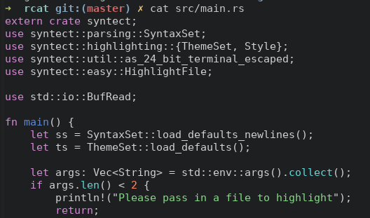

# rcat - Colorized cat written in Rust

Build in release mode:

  $ cargo b --release

Install it to `/usr/local/bin`:

  $ cp target/release/rcat /usr/local/bin/rcat

Optional - Make an alias to replace cat with rcat:

  $ alias cat=rcat
